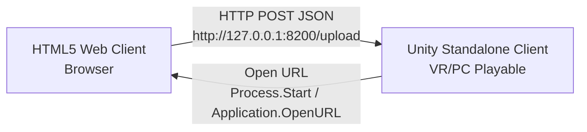

# Body Map VR Experience — 기술 명세서 및 연동 가이드 (Technical Documentation)

본 문서는 **Body Map VR Experience** 프로젝트의 전체 시스템 구조, 적용된 기술, 알고리즘 및 데이터 규격을 정리한 기술 문서입니다. 협업하는 팀원들이 업스트림(웹 클라이언트/데이터 생성) 및 다운스트림(VR 콘텐츠/통신 처리) 파트를 원활하게 연결하고 통합할 수 있도록 상세히 서술되었습니다.

---

## 1. 시스템 아키텍처 개요 (System Architecture)

전체 시스템은 크게 두 가지 컴포넌트 간의 **로컬 비동기 네트워크 통신**으로 동작합니다.



1. **Web Client (웹 클라이언트)**: 사용자가 종이 형태의 바디 맵 양식에 색칠한 이미지를 업로드하면, 브라우저 로컬 환경에서 이미지를 분석하여 세그먼트(감정 영역) 정보를 추출합니다.
2. **Unity Standalone Client (유니티 클라이언트)**: 내장된 HTTP 웹 서버를 통해 웹 클라이언트가 전송한 JSON 데이터를 수신하고, 선택한 3D 가상 공간에 실시간으로 실물 크기(1.5배 스케일)의 바디 맵 모델과 플로팅 감정 오브젝트를 렌더링합니다.

---

## 2. 웹 클라이언트 기술 사양 (Web Client Tech Stack)

웹 클라이언트는 별도의 외부 AI 서버나 API 없이, 오직 브라우저의 성능만을 활용하여 실시간 이미지 프로세싱을 수행하는 **엣지 컴퓨터 비전(Edge Computer Vision)** 모델로 설계되었습니다.

### A. 핵심 기술 및 라이브러리
* **HTML5 Canvas API**: 업로드된 이미지 픽셀 데이터에 직접 접근하고, 분석용 히든 캔버스 렌더링 및 최종 검출 결과 시각화 처리를 수행합니다.
* **Pure JavaScript (ES6, Vanilla)**: 프레임워크 의존성을 배제하여 로컬 파일(`file://`) 환경 및 GitHub Pages 호스팅 환경 어디서나 종속성 없이 매우 가볍게 동작합니다.

### B. 적용된 주요 이미지 처리 알고리즘 & 테크닉
1. **Dynamic Ambient Light/Shadow Adaptation (동적 조명 적응형 이진화)**:
   * 사용자가 카메라로 직접 찍은 실물 종이 검사지는 그림자나 그라데이션 조명 등으로 인해 고정 임계값(Threshold)을 쓰면 외곽선이 깨집니다.
   * 이를 해결하기 위해 이미지의 백그라운드 평균 명도(`meanBackground`)와 최저 명도(`minAvg`)를 구하여 프레임별로 동적 임계값을 계산합니다.
     $$\text{threshold} = \text{minAvg} + (\text{meanBackground} - \text{minAvg}) \times 0.35 \quad (\text{clamped between } 60 \text{ and } 135)$$
2. **Template Margin Noise Discarding (템플릿 마스크 기반 외곽 노이즈 제거)**:
   * 템플릿 실루엣 영역 밖의 노이즈(그림자 테두리, 구겨짐, 볼펜 자국 등)를 무시하기 위해 마스크 매핑 기법을 사용합니다.
   * 오리지널 템플릿 실루엣의 알파 채널 마스크 데이터(`fullOutsideMask`)를 구축하고, 이 범위를 벗어난(`fullOutsideMask[i] === 1`) 픽셀의 드로잉은 강제로 알파를 0으로 만들어 제거합니다.
3. **White Interior Silhouette Fill (실루엣 내부 화이트 퐁 처리)**:
   * 드로잉 영역 내부가 투명하면 3D 공간에서 감정 표현들이 공중에 붕 떠 보이는 이질감이 생깁니다.
   * 이를 해결하기 위해 템플릿 실루엣 내부 영역(`fullOutsideMask[i] === 0`)이면서 사용자가 색칠하지 않은 배경 영역을 **불투명한 흰색(RGBA: 255, 255, 255, 255)**으로 채웁니다.
4. **Connected Component Labeling & Segment Extraction**:
   * 인접한 유색 픽셀들을 그룹화(Flood Fill 응용)하여 개별 영역을 인지합니다.
   * 추출된 영역의 바운딩 박스(`bounding_box`) 좌표와 중심점(`center`) 좌표는 원본 드로잉 크기가 아닌 표준 템플릿 크기(정규화 스페이스: 가로 500, 세로 1000)로 캘리브레이션하여 전송합니다.

---

## 3. 유니티 VR 클라이언트 기술 사양 (Unity Tech Stack)

### A. 핵심 개발 환경 및 씬 구조 (Scene Management)
* **Unity Engine**: `2022.3.62f3` LTS 및 URP (Universal Render Pipeline) 기반
* **비동기 씬 라우팅 매니저**: 플레이어 경험 주기를 유기적으로 컨트롤하기 위해 총 6개의 씬으로 분할 설계되었습니다.
  1. `BootstrapScene`: 게임 초기 실행 시점에 진입하며, 글로벌 오디오 관리자 및 데이터 영속성을 담당하는 `GameManager`, `SceneFlowManager`가 생성되어 도우미 역할을 합니다.
  2. `MapSelectionScene`: 플레이어의 치료 분위기(일본식 정원 또는 사막 오아시스)를 수립하는 선택 UI 화면입니다.
  3. `LoadingScene`: 대용량 리소스(식생, 안개 효과, 3D 콜라이더 등)로 구성된 선택한 테마 씬을 비동기식(`SceneManager.LoadSceneAsync`)으로 로드하고 프레스바를 표기합니다.
  4. `VRArtTherapyScene`: 실제 바디 매핑 수신, AI 상담 인터랙션, Tripo3D 기반 실시간 3D 소환 및 인게임 어노테이션 편집이 일어나는 치료실 메인 공간입니다.
  5. `Env_URP_Garden` / `Env_URP_Desert`: 선택된 정적/동적 레벨 환경 지형을 담고 있으며 메인 치료 공간 밑에 비동기 로딩 및 가산(Additive)되어 연동됩니다.

### B. 주요 구현 기술 및 C# 스크립트 기능
1. **Asynchronous HTTP Web Server (`BodyMapReceiver.cs`)**:
   * C# `System.Net.HttpListener` 클래스를 사용해 백그라운드 스레드 형태로 웹 서버(포트 `8200`)를 상시 리스닝합니다.
   * 수신 처리 연산이 메인 렌더링 스레드와 분리되어 대용량 이미지 데이터를 스트리밍 받아 로드할 때도 프레임 드랍(렉)이 전혀 없습니다.
2. **지면 밀착형 레이캐스트 및 정렬 알고리즘 (Smart Ground Alignment)**:
   * **180도 Y축 정면 고정**: 웹 클라이언트로부터 좌표 수신 시, 해당 텍스처를 3D 공간 상에 생성하며 Y축을 `180`도 기본 회전(flip)하여 항상 플레이어를 정면으로 마주보도록 정렬합니다.
   * **레이캐스팅 바닥 좌표 검출**: 생성과 동시에 스프라이트 피봇 위치에서 하방(`Vector3.down`)으로 가상의 레이(Raycast)를 쏴서 지형 콜라이더와 부딪히는 바닥 높이 `groundY`를 실시간으로 가져옵니다.
   * **하단 피팅 좌표 연산**: `pixelsPerUnit`에 의해 월드 좌표계로 변환된 최종 스프라이트 높이값(`spriteHeight`)을 계산하고, 중심점 Y축 위치를 `groundY + (spriteHeight / 2f)`로 보정하여 아바타 발끝이 지면에 정확히 접하게 밀착 안착시킵니다.
3. **VR/PC Annotation Edit Mode (`InteractiveRegion3D.cs`)**:
   * `Tab` 키로 편집 모드를 진입합니다.
   * **다중 선택 & 외곽선 시각화**: 마우스 클릭으로 다중 감정 스프라이트를 선택하면, 선택된 타겟에 **아웃라인 머티리얼 효과**가 활성화됩니다.
   * **Merge (합치기, 'M' 키)**: 선택된 스프라이트들의 바운딩 박스를 통합하고 픽셀 알파 블렌딩 방식을 거쳐 단일 Sprite로 병합한 후, 색상 필드값과 픽셀 영역 면적 값을 누적 계산해 줍니다.
   * **Delete (삭제, 'Del' 키)**: 오검출되거나 불필요한 감정 오브젝트를 씬 상에서 제거하고 자원을 메모리 반환합니다.
4. **Interactive UI / UX (3D 빌보드 툴팁)**:
   * 각 감정 세그먼트를 클릭 시 3D Description Card(툴팁)가 활성화됩니다.
   * **빌보드 카메라 추적**: 카메라 방향을 향하도록 툴팁 쿼드가 실시간 회전합니다.
   * **위치 및 레이어 최적화**: 겹침을 방지하기 위해 텍스트는 Sorting Order `1000`, 배경 쿼드는 `999`로 강제 지정하고, 로컬 Z축으로 `-0.3f` 밀어 렌더링 우선순위를 최상위로 고정했습니다.
   * **좌우 배치 로직**: 실루엣의 중앙선(`x = 0`)을 기준으로 왼쪽에 있는 영역은 왼쪽 바깥 방향으로, 오른쪽에 있는 영역은 오른쪽 바깥 방향으로 툴팁이 자동 오프셋 정렬됩니다.
5. **Cross-Platform URL Launcher Fallback (`OpenURLHelper.cs`)**:
   * macOS 독립형 빌드 환경에서는 Unity의 `Application.OpenURL`이 기본 브라우저를 띄우지 못하고 무반응으로 끝나는 이슈가 자주 발생합니다.
   * 이를 위해 C# `#if UNITY_STANDALONE_OSX` 컴파일러 지시문을 활용하여, macOS 운영체제 감지 시 `System.Diagnostics.Process.Start("open", url)` 프로세스를 직접 실행하는 플랫폼 특화 코드를 적용했습니다.

---

## 4. 데이터 인터페이스 규격 (API Data Interface)

웹 클라이언트가 분석 후 Unity 서버로 전송하는 HTTP POST 요청의 Body 구조는 아래와 같은 **JSON 포맷**을 따릅니다.

### JSON Payload 명세 (Application/json)
```json
{
  "image": "data:image/png;base64,iVBORw0KGgoAAAANS...", // 분석 영역 합성 PNG (Base64)
  "regions": [
    {
      "id": 1,
      "color_name": "red",
      "pixel_count": 4250,
      "bounding_box": {
        "x": 120.5,     // 정규화된 템플릿(width: 500) 기준 X 시작점
        "y": 250.0,     // 정규화된 템플릿(height: 1000) 기준 Y 시작점
        "width": 60.0,
        "height": 80.0
      },
      "center": {
        "x": 150.0,     // 정규화된 템플릿 기준 중심 X
        "y": 290.0      // 정규화된 템플릿 기준 중심 Y
      },
      "image": "data:image/png;base64,iVBORw0KG..." // 해당 감정 영역만 오려낸 개별 이미지 (Base64)
    }
  ]
}
```

* `image`: 전체 실루엣(화이트 배경 채움) 및 그 위에 입혀진 드로잉이 포함된 텍스트용 원본 크기 데이터입니다.
* `regions`: 세부 감정 영역의 배열로, 각 영역의 ID, 추출된 대표 컬러명, 유색 픽셀 면적 크기, 템플릿 표준 스페이스 대비 바운딩 박스 및 중심점 좌표, 개별 크롭 이미지를 포함합니다.

---

## 5. 빌드 및 배포 형상 관리 (Deploy & CI/CD)

* **저장소 주소**: `https://github.com/jyoon006008/body-map-vr-experience`
* **웹 호스팅**: GitHub Pages를 통해 `/web` 경로를 서비스하고 있습니다.
  * Live URL: `https://jyoon006008.github.io/body-map-vr-experience/web/`
* **바이너리 제공**: `builds/` 폴더 내에 표준 PKZIP 압축 파일로 빌드되어 구글 드라이브(G Drive Desktop)를 통해 연동 배포됩니다.
  * Windows 빌드: `BodyMapVR_Windows.zip` (추출 시 `BodyMapVR.exe` 실행)
  * macOS 빌드: `BodyMapVR_Mac.zip` (추출 시 `BodyMapVR.app` 번들 실행)
